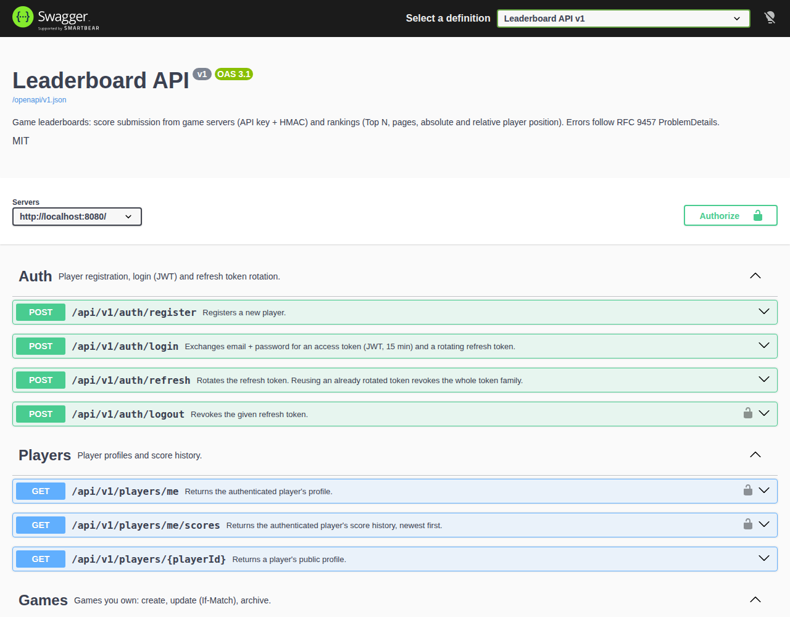
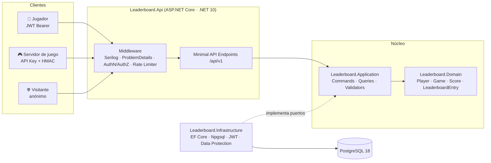

# 🏆 Leaderboard REST API

**API de clasificaciones para videojuegos**: los servidores de juego envían puntuaciones firmadas y cualquier cliente consulta rankings, Top N y la posición absoluta o relativa de un jugador.

[](https://github.com/alba-alonso-dev/leaderboard-api/actions/workflows/ci.yml)


```bash
git clone https://github.com/alba-alonso-dev/leaderboard-api.git && cd leaderboard-api
docker compose up -d --wait          # API + PostgreSQL 18, migraciones automáticas
open http://localhost:8080/swagger   # (Linux: xdg-open)
```



---

## ¿Por qué este proyecto?

Es un proyecto de portafolio que muestra, en un dominio pequeño y fácil de entender, lo que se espera de un backend profesional en .NET:

| Área | Qué demuestra |
|---|---|
| **Diseño de API** | Contrato REST versionado (`/api/v1`), paginación, validación con FluentValidation, errores **RFC 9457 ProblemDetails** con `code` estable y `traceId`, `ETag`/`If-Match`. |
| **Arquitectura** | **Clean Architecture** (Domain · Application · Infrastructure · Api) con CQRS liviano sin mediador; límites verificados por **tests de arquitectura**. |
| **Seguridad** | **JWT** con refresh tokens rotatorios y detección de robo para jugadores; **API Key + firma HMAC-SHA256** con anti-replay idempotente para servidores de juego; secretos cifrados con Data Protection; controles OWASP API Top 10. |
| **Datos** | Histórico inmutable + proyección de mejor marca en **PostgreSQL**; upsert atómico `ON CONFLICT`; índice cubriente con búsquedas *keyset* por tupla. |
| **Rendimiento medido** | Benchmark **k6** con 100 000 jugadores: p95 < 50 ms en todas las lecturas tras diagnosticar y rediseñar el índice ([informe](docs/performance.md)). |
| **Calidad** | 180 tests: unitarios, integración con `WebApplicationFactory` + **Testcontainers** (PostgreSQL real) y arquitectura. Cobertura ≥ 96 % con umbral en CI. |
| **Operación** | **Docker** (imagen *chiseled* no root) + **Compose**, **GitHub Actions**, **Serilog** JSON con correlación de `traceId`, health checks, **rate limiting** nativo. |
| **Ingeniería** | Requisitos trazables a tareas y tests, y 4 **ADRs** con alternativas y consecuencias. |

## Arquitectura



Las dependencias apuntan siempre hacia el **Dominio**. Detalle de capas, modelo E/R, endpoints y flujos de seguridad en [docs/architecture.md](docs/architecture.md).

```text
src/
├── Leaderboard.Domain/          Entidades con invariantes, Result<T>, errores de dominio (sin dependencias)
├── Leaderboard.Application/     Casos de uso (handlers), validadores, puertos, firma HMAC
├── Leaderboard.Infrastructure/  EF Core + migraciones, repositorios, SQL de ranking, JWT, PBKDF2, Data Protection
└── Leaderboard.Api/             Minimal APIs, autenticación, ProblemDetails, rate limiting, OpenAPI, health checks
tests/                           Domain/Application unit tests · Api integration tests · Architecture tests
docs/                            Requisitos, arquitectura, roadmap, estándares, rendimiento, ADRs (MD + HTML)
perf/                            Script k6 y seed de 100 000 jugadores
samples/submit-score.sh          Cliente de referencia que firma envíos (bash + openssl)
scripts/                         Smoke test E2E, generador de documentación, gate de cobertura
```

## Endpoints principales

| Método | Ruta | Auth | Descripción |
|---|---|---|---|
| `POST` | `/api/v1/auth/register` · `/login` · `/refresh` · `/logout` | — / JWT | Registro, login JWT y rotación de refresh tokens |
| `POST` | `/api/v1/games` | JWT | Registrar un juego (el usuario pasa a ser propietario) |
| `PUT` · `DELETE` | `/api/v1/games/{gameId}` | JWT (owner) | Actualizar con `If-Match` · archivar |
| `POST` | `/api/v1/games/{gameId}/api-keys` | JWT (owner) | Emitir credenciales para el servidor del juego (secreto visible una vez) |
| `POST` | `/api/v1/games/{gameId}/scores` | API Key + HMAC | Enviar una puntuación (idempotente por nonce) |
| `GET` | `/api/v1/games/{gameId}/leaderboard/top?n=10` | — | Top N |
| `GET` | `/api/v1/games/{gameId}/leaderboard?page=1&pageSize=20` | — | Ranking paginado |
| `GET` | `/api/v1/games/{gameId}/leaderboard/players/{playerId}` | — | Posición absoluta y percentil |
| `GET` | `/api/v1/games/{gameId}/leaderboard/players/{playerId}/around?range=5` | — | Jugadores por encima y por debajo |
| `GET` | `/api/v1/games/{gameId}/leaderboard/me` | JWT | Mi posición |
| `DELETE` | `/api/v1/admin/scores/{scoreId}` | JWT (admin) | Moderación: invalida y recalcula |
| `GET` | `/health/live` · `/health/ready` | — | Health checks |

Catálogo completo (23 endpoints), payloads y códigos de error: [architecture.md §4](docs/architecture.md#4-diseño-de-endpoints-restful).

## Inicio rápido

### Con Docker (recomendado, sin instalar .NET)

```bash
docker compose up -d --wait        # construye la imagen, arranca PostgreSQL y aplica migraciones
./scripts/smoke-test.sh            # opcional: recorrido E2E automático (auth → juego → score firmado → ranking)
docker compose down                # parar (añade -v para borrar los datos)
```

Todas las variables tienen valores de desarrollo; para cambiarlos copia [`.env.example`](.env.example) a `.env`.

### Recorrido en Swagger (`http://localhost:8080/swagger`)

1. `POST /api/v1/auth/register` y `POST /api/v1/auth/login` → copia `accessToken`.
2. **Authorize → Bearer**: pega el token.
3. `POST /api/v1/games` → `POST /api/v1/games/{gameId}/api-keys` → copia `keyId` y `secret`.
4. **Authorize → ApiKeyHmac**: escribe `keyId:secret`. En Development, Swagger UI **firma cada petición en el navegador** (WebCrypto); el secreto nunca se envía al servidor.
5. `POST /api/v1/games/{gameId}/scores` con `{"playerId": "<tu id>", "value": 4200}`.
6. `GET /api/v1/games/{gameId}/leaderboard/top` y `…/players/{playerId}/around`.

Desde terminal, el mismo envío firmado: `./samples/submit-score.sh <gameId> <keyId> <secret> <playerId> 4200`.

**Administrador de demo** (moderación): `admin@leaderboard.local` / `Admin-dev-Passw0rd` (configurable con `ADMIN_EMAIL`/`ADMIN_PASSWORD`).

### Con el SDK de .NET 10

```bash
docker compose up -d postgres                  # solo la base de datos
dotnet run --project src/Leaderboard.Api       # http://localhost:8080/swagger (logs en texto)
```

## Tests y calidad

```bash
dotnet test                                    # 180 tests (integración con Testcontainers: requiere Docker)
dotnet format --verify-no-changes              # estilo (.editorconfig)
```

| Suite | Tests | Qué cubre |
|---|---:|---|
| `Leaderboard.Domain.UnitTests` | 32 | Normalización de `rank_key`, rango permitido, archivado, rotación de refresh tokens |
| `Leaderboard.Application.UnitTests` | 64 | Validadores, autenticador HMAC (`FakeTimeProvider`), handlers de auth y envío (replay, nonce reutilizado, límites) |
| `Leaderboard.Api.IntegrationTests` | 73 | HTTP extremo a extremo contra PostgreSQL 18 real: BOLA, `If-Match`, HMAC manipulado/caducado, concurrencia, ranking y desempates, moderación, ProblemDetails, OpenAPI, caída de BD, rate limiting, correlación log ↔ `traceId` |
| `Leaderboard.ArchitectureTests` | 11 | Regla de dependencias, handlers `sealed internal`, un handler por caso de uso, dominio sin setters públicos |

Cobertura de líneas: Domain 98 % · Application 96,5 % · Infrastructure 99,4 % · Api 97,9 %.

**CI** ([`.github/workflows/ci.yml`](.github/workflows/ci.yml)): formato → build con *warnings as errors* → tests con cobertura (umbral 80 % en Domain + Application) → auditoría de paquetes vulnerables → `docker compose up` + smoke test E2E → documentación HTML actualizada. Dependabot para NuGet, Actions y Docker.

## Rendimiento

k6 con **100 000 jugadores**, 100 lecturas/s + 20 envíos firmados/s ([informe completo](docs/performance.md)):

| p95 | Top 10 | Página | Posición | Ventana ±5 | Envío firmado |
|---|---:|---:|---:|---:|---:|
| Diseño inicial | 263 ms | 4 670 ms | 782 ms | 2 850 ms | 1 090 ms |
| **Diseño final** | **11,6 ms** | **48,8 ms** | **32,9 ms** | **38,8 ms** | **52,9 ms** |

La primera medición no cumplía el objetivo. `EXPLAIN ANALYZE` mostró joins sobre toda la tabla, `COUNT(*)` en cada petición y un índice de direcciones mixtas que impedía las búsquedas *keyset*. La solución fue una clave de ranking normalizada con índice ascendente cubriente, paginar antes del join y un contador exacto mantenido en la misma sentencia del upsert.

## Stack

| Capa | Tecnología |
|---|---|
| Runtime / Web | ASP.NET Core **.NET 10 LTS**, Minimal APIs |
| Persistencia | EF Core 10 + Npgsql · **PostgreSQL 18** |
| Seguridad | JWT Bearer, `PasswordHasher<T>` (PBKDF2), HMAC-SHA256, ASP.NET Core Data Protection |
| Contrato | OpenAPI 3.1 (`Microsoft.AspNetCore.OpenApi`) + Swagger UI |
| Validación / errores | FluentValidation · ProblemDetails (RFC 9457) |
| Tests | xUnit v3 (Microsoft.Testing.Platform) · `WebApplicationFactory` · Testcontainers · Respawn · Shouldly · NSubstitute · NetArchTest |
| Observabilidad | Serilog (JSON) · Health Checks · Rate Limiting nativo |
| DevOps | Docker (*chiseled*, no root) · Docker Compose · GitHub Actions · Dependabot · k6 |

## Roadmap

| Mes | Fase | Entregable | Estado |
|---|---|---|---|
| Sep–Oct | **0 · Diseño** | Requerimientos, arquitectura, plan y estándares | ✅ |
| Noviembre | **1 · Base funcional** | Auth JWT, juegos, API Keys, envío de scores, rankings y Swagger | ✅ |
| Diciembre | **2 · Calidad** | Tests unitarios + integración (Testcontainers), refresh tokens | ✅ |
| Enero | **3 · Arquitectura** | Clean Architecture verificada por tests, firma HMAC + idempotencia, ADR-001/002/003 | ✅ |
| Febrero | **4 · DevOps** | Dockerfile, Docker Compose con PostgreSQL, CI en GitHub Actions | ✅ |
| Marzo | **5 · Producción** | Serilog estructurado, health checks, rate limiting, benchmark, ADR-004 | ✅ |

Pendiente: publicar tags/releases y activar la protección de rama en GitHub, y la heurística de plausibilidad RF-32 (*Could*). Detalle en [docs/roadmap-and-tasks.md](docs/roadmap-and-tasks.md).

## Documentación

Toda la documentación está en Markdown (fuente) y en HTML navegable con diagramas renderizados ([docs/index.html](docs/index.html)).

| Documento | Markdown | HTML |
|---|---|---|
| Índice | [docs/index.md](docs/index.md) | [docs/index.html](docs/index.html) |
| Requerimientos (RF, RNF, historias Gherkin) | [requirements.md](docs/requirements.md) | [requirements.html](docs/requirements.html) |
| Arquitectura y diseño | [architecture.md](docs/architecture.md) | [architecture.html](docs/architecture.html) |
| Roadmap y tareas | [roadmap-and-tasks.md](docs/roadmap-and-tasks.md) | [roadmap-and-tasks.html](docs/roadmap-and-tasks.html) |
| Estándares de código y testing | [coding-standards.md](docs/coding-standards.md) | [coding-standards.html](docs/coding-standards.html) |
| Rendimiento | [performance.md](docs/performance.md) | [performance.html](docs/performance.html) |
| ADR-001 · PostgreSQL | [0001-postgresql.md](docs/adr/0001-postgresql.md) | [HTML](docs/adr/0001-postgresql.html) |
| ADR-002 · Clean Architecture | [0002-clean-architecture.md](docs/adr/0002-clean-architecture.md) | [HTML](docs/adr/0002-clean-architecture.html) |
| ADR-003 · Anti-cheat | [0003-anti-cheat.md](docs/adr/0003-anti-cheat.md) | [HTML](docs/adr/0003-anti-cheat.html) |
| ADR-004 · Mejoras futuras | [0004-future-improvements.md](docs/adr/0004-future-improvements.md) | [HTML](docs/adr/0004-future-improvements.html) |

```bash
python3 -m pip install -r scripts/requirements-docs.txt   # una sola vez
python3 scripts/build_docs.py                            # regenera docs/**/*.html (el CI comprueba que estén al día)
python3 -m http.server 8000 -d docs                      # http://localhost:8000
```

> Los HTML también pueden publicarse con **GitHub Pages** (Settings → Pages → *Deploy from branch* → `main` / `/docs`).

## Fuera de alcance

Frontend, WebSockets/tiempo real, microservicios y Redis quedan fuera de la v1.0 de forma deliberada. El [ADR-004](docs/adr/0004-future-improvements.md) recoge, para cada uno, el disparador medible que justificaría incorporarlo y el punto de extensión ya previsto.

## Criterio de aceptación del proyecto

> Clonar el repositorio → `docker compose up` → Swagger accesible en local para probar **Auth + Score Submit + Ranking** → pipeline de CI **en verde** en GitHub Actions.

## Licencia

[MIT](LICENSE)
