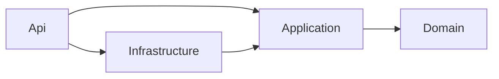

# ADR-002 · Adopción de Clean Architecture

> **Estado:** Aceptado · **Fecha:** 2027-01 · **Decisores:** autora del proyecto  
> **Relacionados:** [Arquitectura §2](../architecture.md#2-estructura-de-capas-clean-architecture) · [Estándares §3](../coding-standards.md#3-patrones-aplicados)

## Contexto

El proyecto es pequeño (≈ 20 endpoints) pero su objetivo es **demostrar criterio de diseño** en entrevistas técnicas y servir de base evolutiva (tiempo real, caché, extracción de servicios). Necesitamos:

- Reglas de negocio (orden de puntuación, rango permitido, idempotencia, rotación de tokens) testeables **sin HTTP ni base de datos**.
- Poder sustituir detalles de infraestructura (PostgreSQL → caché Redis para rankings, HS256 → RS256) sin tocar casos de uso.
- Límites verificables automáticamente, no solo por convención.

El roadmap original planteaba empezar con un único proyecto y refactorizar en enero. Al ejecutar todas las fases de forma consecutiva se partió directamente de la estructura final, con los tests de integración como contrato.

## Decisión

Cuatro proyectos con dependencias hacia dentro, verificadas por tests de arquitectura (NetArchTest):

- **Domain**: entidades con invariantes (`Game.EnsureAcceptsScore`, `Game.ToSortKey`, `RefreshToken.WasRotated`), errores de dominio, `Result<T>`. Sin dependencias NuGet.
- **Application**: casos de uso como *handlers* (CQRS liviano sin mediador), validadores FluentValidation, puertos (`IScoreRepository`, `ILeaderboardReadService`, `ITokenService`, `IApiKeySecretProtector`…). Decoradores de validación y logging vía Scrutor.
- **Infrastructure**: EF Core, SQL de ranking, JWT, PBKDF2, Data Protection.
- **Api**: Minimal APIs, esquemas de autenticación, ProblemDetails, rate limiting, OpenAPI, health checks.

## Alternativas consideradas

| Alternativa | A favor | En contra |
|---|---|---|
| **Monolito en un proyecto (N-capas por carpetas)** | Mínima ceremonia; rápido para un MVP. | Nada impide que un endpoint use `DbContext` directamente; los límites se erosionan. |
| **Vertical Slice Architecture** | Cohesión por feature; menos abstracciones. | Con tan pocas features, la ganancia es pequeña; las reglas de dominio compartidas (orden de puntuación) acaban duplicadas o en un «Common» difuso. |
| **Clean Architecture + MediatR** | Patrón muy conocido. | MediatR es de licencia comercial desde v13 y añade indirección (`ISender.Send`) sin beneficio a esta escala. |
| **Clean Architecture con handlers inyectados** ✅ | Límites verificables, dominio puro, navegación directa (*Go to definition*). | Más proyectos y tipos; hay que evitar la sobre-abstracción. |

## Consecuencias

**Positivas**

- 90+ tests unitarios de Domain y Application se ejecutan en segundos sin Docker.
- La lógica de firma HMAC vive en Application (`ApiKeyAuthenticator`) y se prueba con `FakeTimeProvider`; el handler HTTP solo traduce cabeceras.
- Los tests de arquitectura fallan el build si Application referencia EF Core o si un endpoint accede a `DbContext`.

**Negativas / límites deliberados**

- **Lecturas de ranking fuera del patrón repositorio**: `ILeaderboardReadService` devuelve proyecciones directamente (CQRS). Forzar agregados aquí penalizaría rendimiento sin aportar invariantes.
- **No hay `IRepository<T>` genérico** ni `IQueryable` en Application: cada repositorio expone métodos con intención de negocio.
- **Autorización de propietario en el caso de uso** (`GetOwnedAsync` → `404`), no con `IAuthorizationHandler` por recurso: el dato necesario se carga igualmente en el handler y así la regla queda testeada en un único sitio.
