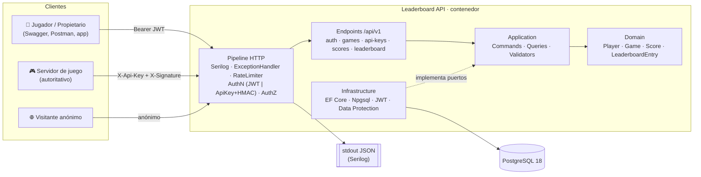
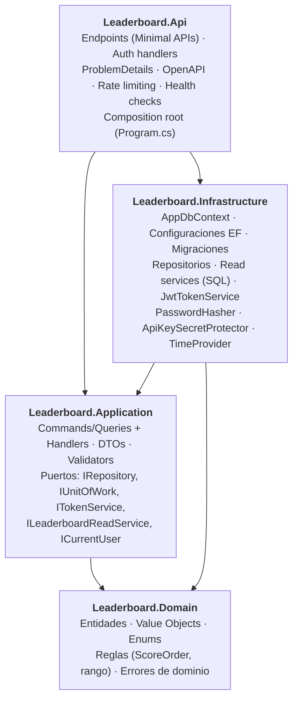
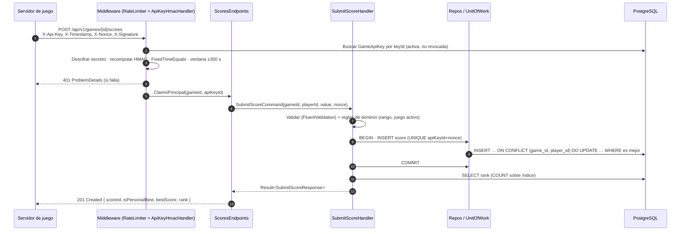
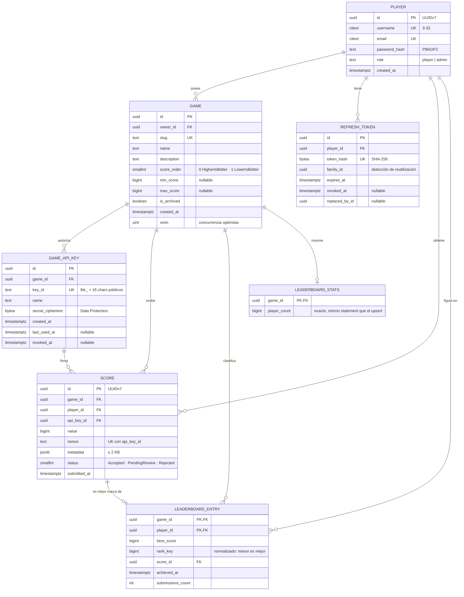
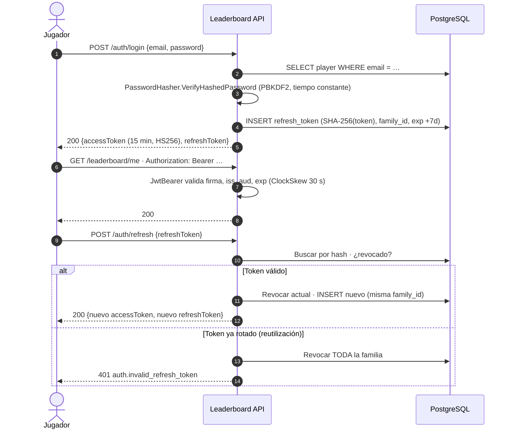
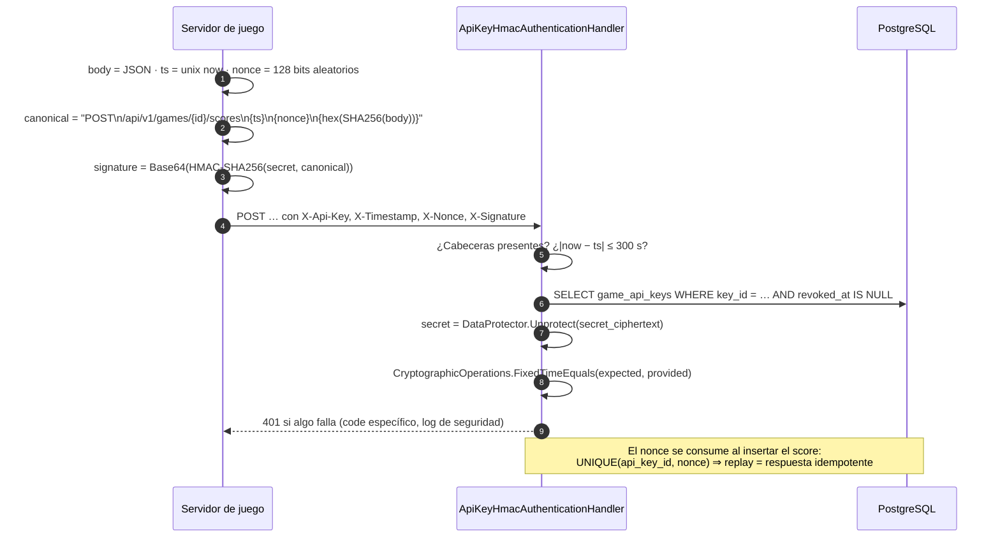
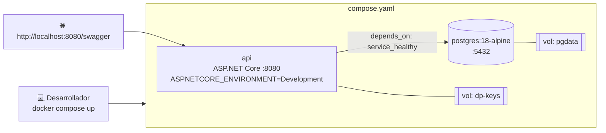

# Arquitectura y Diseño

> **Documento:** `docs/architecture.md` · **Estado:** Implementado (v1.0) · **Versión:** 1.1  
> **Relacionados:** [Requerimientos](requirements.md) · [Roadmap y tareas](roadmap-and-tasks.md) · [Estándares de código](coding-standards.md)

## 1. Visión general

Monolito modular en **ASP.NET Core (.NET 10 LTS)** organizado con **Clean Architecture**, persistencia en **PostgreSQL** vía **EF Core**, y dos canales de autenticación independientes: **JWT** para personas y **API Key + HMAC** para servidores de juego.



### 1.1 Principios de diseño

1. **La regla de dependencia es sagrada:** `Domain` no conoce a nadie; `Application` solo conoce `Domain`; `Infrastructure` y `Api` dependen hacia dentro. Verificado con tests de arquitectura.
2. **Escritura separada de lectura (CQRS liviano):** los comandos pasan por el modelo de dominio y repositorios; las consultas de ranking son proyecciones SQL optimizadas (sin cargar agregados).
3. **Seguro por defecto:** todo endpoint requiere autenticación salvo que se marque explícitamente `AllowAnonymous`; todo recurso de propietario se autoriza por recurso.
4. **Errores como contrato:** cada fallo esperado tiene un `code` estable y se traduce a ProblemDetails en un único punto.
5. **Evolución incremental:** noviembre arranca con un único proyecto *organizado por carpetas que ya reflejan las capas*, de modo que el refactor de enero sea mover carpetas a proyectos, no reescribir.

---

## 2. Estructura de capas (Clean Architecture)



### 2.1 Estructura de la solución (objetivo en Enero)

```text
leaderboard-api/
├── src/
│   ├── Leaderboard.Domain/
│   │   ├── Common/            # Entity, AggregateRoot, Error, Result<T>
│   │   ├── Players/           # Player, Username (VO), Email (VO), PlayerErrors
│   │   ├── Games/             # Game, GameSlug (VO), ScoreOrder, ScoreRange, GameApiKey
│   │   └── Scores/            # Score, LeaderboardEntry, ScoreStatus, ScoreErrors
│   ├── Leaderboard.Application/
│   │   ├── Abstractions/      # ICommandHandler<,>, IQueryHandler<,>, IUnitOfWork, ICurrentUser, IClock…
│   │   ├── Auth/              # Register, Login, Refresh, Logout
│   │   ├── Games/             # CreateGame, UpdateGame, ArchiveGame, ListGames, GetGame
│   │   ├── ApiKeys/           # IssueApiKey, RevokeApiKey, ListApiKeys
│   │   ├── Scores/            # SubmitScore, GetPlayerScoreHistory
│   │   ├── Leaderboards/      # GetTop, GetPage, GetPlayerRank, GetAroundPlayer
│   │   └── Common/            # PagedResult<T>, PageRequest, ValidationBehavior (decorator)
│   ├── Leaderboard.Infrastructure/
│   │   ├── Persistence/       # AppDbContext, Configurations/, Migrations/, Repositories/
│   │   ├── ReadModels/        # LeaderboardReadService (SQL/LINQ proyectado)
│   │   ├── Security/          # JwtTokenService, RefreshTokenService, ApiKeySecretProtector
│   │   └── DependencyInjection.cs
│   └── Leaderboard.Api/
│       ├── Endpoints/         # AuthEndpoints, GamesEndpoints, ScoresEndpoints, LeaderboardEndpoints
│       ├── Authentication/    # ApiKeyHmacAuthenticationHandler
│       ├── ErrorHandling/     # GlobalExceptionHandler, ResultExtensions (Result → IResult)
│       ├── OpenApi/           # Transformers (security schemes, ejemplos)
│       └── Program.cs
├── tests/
│   ├── Leaderboard.Domain.UnitTests/
│   ├── Leaderboard.Application.UnitTests/
│   ├── Leaderboard.Api.IntegrationTests/     # WebApplicationFactory + Testcontainers
│   └── Leaderboard.ArchitectureTests/        # NetArchTest
├── docs/                   # Este diseño + ADRs (docs/adr/)
├── Dockerfile · compose.yaml · Directory.Build.props · Directory.Packages.props
└── .github/workflows/ci.yml
```

### 2.2 Responsabilidades por capa

| Capa | Contiene | No contiene | Paquetes permitidos |
|---|---|---|---|
| **Domain** | Entidades con invariantes, VOs inmutables, enums, errores de dominio, lógica de «¿es mejor este score?» | EF, ASP.NET, DTOs, logging | Ninguno (solo BCL) |
| **Application** | Casos de uso (handlers), validadores, DTOs de entrada/salida, interfaces (puertos) | `DbContext`, `HttpContext`, SQL | FluentValidation, `Microsoft.Extensions.*.Abstractions` |
| **Infrastructure** | Implementaciones de puertos: EF Core, repositorios, read services, JWT, cifrado | Endpoints, reglas de negocio | EF Core, Npgsql, `System.IdentityModel.Tokens.Jwt`, Data Protection |
| **Api** | HTTP: rutas, binding, authN/authZ, mapeo `Result → IResult`, OpenAPI, middleware | Reglas de negocio, SQL | ASP.NET Core, Serilog, Swashbuckle UI, HealthChecks |

### 2.3 Flujo de una petición (envío de score)



---

## 3. Modelo de datos

### 3.1 Diagrama Entidad-Relación



### 3.2 Decisiones clave del modelo

| Decisión | Justificación |
|---|---|
| **`SCORE` (histórico inmutable) separado de `LEADERBOARD_ENTRY` (proyección)** | Ranking = 1 fila por jugador → consultas de posición O(log n + k) sin `GROUP BY` sobre millones de eventos. El histórico permite auditoría y recálculo (RF-33). |
| **`rank_key` normalizado (menor es mejor)** | `rank_key = -value` si `HigherIsBetter`, `value` si `LowerIsBetter`. El orden del ranking es `(rank_key, achieved_at, player_id)` **todo ascendente**: un único índice sirve a ambos órdenes y al desempate, y admite comparaciones de tuplas `(…) < (…)` como búsquedas de rango. Ver [performance.md](performance.md). |
| **`leaderboard_stats.player_count`** | Total exacto de jugadores por juego sin `COUNT(*)`: se incrementa en la misma sentencia del upsert cuando el jugador obtiene su primera entrada (`RETURNING (xmax = 0)`). |
| **UUIDv7 (`Guid.CreateVersion7()`)** | Identificadores no enumerables (mitiga BOLA) y ordenables por tiempo (inserciones amigables con B-tree). |
| **`citext` para username/email** | Unicidad insensible a mayúsculas sin `LOWER()` en cada consulta. |
| **`UNIQUE (api_key_id, nonce)` en `SCORE`** | Idempotencia y protección de *replay* garantizadas por la BD, no por memoria. |
| **Secreto de API Key cifrado (no hasheado)** | HMAC requiere que el servidor conozca el secreto para recomputar la firma. Se cifra con ASP.NET Core Data Protection; el *key ring* vive fuera de la BD (volumen / en producción, Key Vault). Ver ADR-003. |
| **`xmin` como token de concurrencia en `GAME`** | Concurrencia optimista nativa de PostgreSQL con Npgsql, sin columna extra. |
| **Soft delete de `GAME` (`is_archived`)** | Preserva rankings históricos y la integridad referencial de scores. |

### 3.3 Índices

| Tabla | Índice | Uso |
|---|---|---|
| `leaderboard_entries` | PK `(game_id, player_id)` | Upsert de mejor marca, lookup de un jugador. |
| `leaderboard_entries` | `ix_leaderboard_entries_rank (game_id, rank_key, achieved_at, player_id) INCLUDE (best_score, score_id)` | Top N y páginas (*Index Only Scan*), conteo de rango y ventana relativa (búsquedas por tupla). |
| `scores` | `ux_scores_nonce (api_key_id, nonce)` UNIQUE | Idempotencia / anti-replay. |
| `scores` | `ix_scores_player_game (player_id, game_id, submitted_at DESC)` | Historial de un jugador. |
| `game_api_keys` | `ux_api_keys_key_id (key_id)` UNIQUE | Autenticación de servidor. |
| `refresh_tokens` | `ux_refresh_token_hash (token_hash)` UNIQUE | Refresh. |
| `players` | `ux_players_email`, `ux_players_username` UNIQUE | Registro / login. |

### 3.4 Consultas críticas (referencia de implementación)

**Upsert de mejor marca + contador** (una sola sentencia dentro de la transacción del envío; atómica frente a concurrencia):

```sql
WITH upsert AS (
    INSERT INTO leaderboard_entries (game_id, player_id, best_score, rank_key, score_id, achieved_at, submissions_count)
    VALUES (@gameId, @playerId, @value, @rankKey, @scoreId, @now, 1)
    ON CONFLICT (game_id, player_id) DO UPDATE SET
        submissions_count = leaderboard_entries.submissions_count + 1,
        best_score  = CASE WHEN EXCLUDED.rank_key < leaderboard_entries.rank_key THEN EXCLUDED.best_score  ELSE leaderboard_entries.best_score  END,
        score_id    = CASE WHEN EXCLUDED.rank_key < leaderboard_entries.rank_key THEN EXCLUDED.score_id    ELSE leaderboard_entries.score_id    END,
        achieved_at = CASE WHEN EXCLUDED.rank_key < leaderboard_entries.rank_key THEN EXCLUDED.achieved_at ELSE leaderboard_entries.achieved_at END,
        rank_key    = LEAST(EXCLUDED.rank_key, leaderboard_entries.rank_key)
    RETURNING (xmax = 0) AS inserted
)
INSERT INTO leaderboard_stats (game_id, player_count)
SELECT @gameId, 1 FROM upsert WHERE inserted
ON CONFLICT (game_id) DO UPDATE SET player_count = leaderboard_stats.player_count + 1;
```

**Rango absoluto** (1 + entradas estrictamente por delante; la comparación de tuplas usa el índice):

```sql
SELECT COUNT(*) + 1
FROM leaderboard_entries
WHERE game_id = @gameId
  AND (rank_key, achieved_at, player_id) < (@rankKey, @achievedAt, @playerId);
```

**Ventana relativa** (`k` por encima y `k` por debajo): dos búsquedas *keyset* sobre el índice (`… < (…) ORDER BY … DESC LIMIT k` y `… > (…) ORDER BY … LIMIT k`, *Index Scan Backward* en 0,1 ms) con rangos derivados del rango absoluto. Evita `ROW_NUMBER()` sobre toda la tabla.

**Top N / páginas**: se pagina el índice primero (`ORDER BY rank_key, achieved_at, player_id OFFSET … LIMIT …`) y solo después se unen los `username` de las filas devueltas.

> **Límites conocidos:** el rango absoluto es O(rango) y la paginación O(offset). Con 100 000 jugadores el p95 está por debajo de 50 ms ([performance.md](performance.md)); por encima de ~1 M, la alternativa documentada es Redis Sorted Sets ([ADR-004](adr/0004-future-improvements.md)).

---

## 4. Diseño de Endpoints RESTful

**Convenciones:** base `/api/v1` · JSON `camelCase` · fechas ISO-8601 UTC · IDs UUID · rutas en plural y `kebab-case` · colecciones paginadas · errores `application/problem+json`.

### 4.1 Catálogo

| # | Método | Ruta | Auth | Descripción | Éxito | Errores |
|---|---|---|---|---|---|---|
| 1 | `POST` | `/api/v1/auth/register` | Anónimo · RL `auth` | Registrar jugador | `201` | `400`, `409`, `429` |
| 2 | `POST` | `/api/v1/auth/login` | Anónimo · RL `auth` | Login → tokens | `200` | `400`, `401`, `429` |
| 3 | `POST` | `/api/v1/auth/refresh` | Anónimo · RL `auth` | Rotar refresh token | `200` | `400`, `401` |
| 4 | `POST` | `/api/v1/auth/logout` | JWT | Revocar refresh token | `204` | `401` |
| 5 | `GET` | `/api/v1/players/me` | JWT | Perfil propio | `200` | `401` |
| 6 | `GET` | `/api/v1/players/me/scores?gameId=&page=&pageSize=` | JWT | Historial propio | `200` | `400`, `401` |
| 7 | `POST` | `/api/v1/games` | JWT | Crear juego | `201` | `400`, `401`, `409` |
| 8 | `GET` | `/api/v1/games?page=&pageSize=&search=` | Anónimo | Listar juegos activos | `200` | `400` |
| 9 | `GET` | `/api/v1/games/{gameId}` | Anónimo | Detalle de juego | `200` | `404` |
| 10 | `PUT` | `/api/v1/games/{gameId}` | JWT · Owner · `If-Match` opcional | Reemplazar metadatos editables (`scoreOrder` es inmutable) | `200` + `ETag` | `400`, `401`, `404`, `412` |
| 11 | `DELETE` | `/api/v1/games/{gameId}` | JWT · Owner | Archivar (soft delete) | `204` | `401`, `404` |
| 12 | `POST` | `/api/v1/games/{gameId}/api-keys` | JWT · Owner | Emitir API Key | `201` | `401`, `404`, `409` |
| 13 | `GET` | `/api/v1/games/{gameId}/api-keys` | JWT · Owner | Listar claves (sin secreto) | `200` | `401`, `404` |
| 14 | `DELETE` | `/api/v1/games/{gameId}/api-keys/{apiKeyId}` | JWT · Owner | Revocar clave | `204` | `401`, `404` |
| 15 | `POST` | `/api/v1/games/{gameId}/scores` | ApiKey+HMAC · RL `score-submit` | Enviar score | `201` / `202` / `200`¹ | `400`, `401`, `403`, `409`, `422`, `429` |
| 16 | `GET` | `/api/v1/games/{gameId}/leaderboard?page=&pageSize=` | Anónimo · RL `public-read` | Ranking paginado | `200` | `400`, `404` |
| 17 | `GET` | `/api/v1/games/{gameId}/leaderboard/top?n=10` | Anónimo · RL `public-read` | Top N | `200` | `400`, `404` |
| 18 | `GET` | `/api/v1/games/{gameId}/leaderboard/players/{playerId}` | Anónimo · RL `public-read` | Posición absoluta | `200` | `404` |
| 19 | `GET` | `/api/v1/games/{gameId}/leaderboard/players/{playerId}/around?range=5` | Anónimo · RL `public-read` | Posición relativa | `200` | `400`, `404` |
| 20 | `GET` | `/api/v1/games/{gameId}/leaderboard/me` | JWT | Mi posición | `200` | `401`, `404` |
| 21 | `DELETE` | `/api/v1/admin/scores/{scoreId}` | JWT · rol `admin` | Invalidar score y recalcular la mejor marca (RF-33) | `204` | `401`, `403`, `404` |
| 22 | `GET` | `/health/live` · `/health/ready` | Anónimo | Health checks | `200` | `503` |
| 23 | `GET` | `/api/v1/players/{playerId}` | Anónimo · RL `public-read` | Perfil público (sin email) | `200` | `404` |
| 24 | `GET` | `/api/v1/admin/scores?status=PendingReview&gameId=&page=&pageSize=` | JWT · rol `admin` | Cola de moderación, más antiguos primero (RF-32) | `200` | `400`, `401`, `403` |
| 25 | `POST` | `/api/v1/admin/scores/{scoreId}/approve` | JWT · rol `admin` | Aprobar un score retenido: entra en el ranking (RF-32) | `204` | `401`, `403`, `404`, `409` |

¹ `200 OK` cuando la petición es un reintento idempotente (mismo `nonce`) y se devuelve el resultado original; `202 Accepted` cuando el score queda retenido para revisión (`status: "PendingReview"`).

### 4.2 Payloads principales

**`POST /api/v1/auth/register`**

```json
// Request
{ "username": "ana_dev", "email": "ana@example.com", "password": "Sup3rSecret!" }
// 201 Created · Location: /api/v1/players/0192f0c1-…
{ "id": "0192f0c1-7a2b-7cc3-9d10-5b1e2f3a4b5c", "username": "ana_dev", "createdAt": "2026-11-04T10:15:00Z" }
```

**`POST /api/v1/auth/login`**

```json
// Request
{ "email": "ana@example.com", "password": "Sup3rSecret!" }
// 200 OK
{ "accessToken": "eyJhbGciOiJIUzI1NiIs…", "tokenType": "Bearer", "expiresIn": 900,
  "refreshToken": "r1_9QpF…", "refreshTokenExpiresAt": "2026-11-11T10:15:00Z" }
```

**`POST /api/v1/games`**

```json
// Request
{ "name": "Space Blaster", "slug": "space-blaster", "description": "Arcade shooter",
  "scoreOrder": "HigherIsBetter", "minScore": 0, "maxScore": 1000000 }
// 201 Created · Location: /api/v1/games/{gameId}
{ "id": "…", "slug": "space-blaster", "name": "Space Blaster", "scoreOrder": "HigherIsBetter",
  "minScore": 0, "maxScore": 1000000, "isArchived": false, "createdAt": "…" }
```

**`POST /api/v1/games/{gameId}/api-keys`**

```json
// Request
{ "name": "prod-server" }
// 201 Created — el secreto NO se vuelve a mostrar
{ "id": "…", "keyId": "lbk_7f3a9c2e1b4d8f60", "name": "prod-server",
  "secret": "lbs_Zk3…(43 chars base64url, 256 bits)", "createdAt": "…" }
```

**`POST /api/v1/games/{gameId}/scores`** (servidor de juego)

```http
POST /api/v1/games/0192f0c1-…/scores HTTP/1.1
Content-Type: application/json
X-Api-Key: lbk_7f3a9c2e1b4d8f60
X-Timestamp: 1730715300
X-Nonce: b1946ac92492d2347c6235b4d2611184
X-Signature: 3q2+7w6… (base64 HMAC-SHA256)

{ "playerId": "0192f0c1-…", "value": 7200, "metadata": { "level": 12, "durationMs": 184000 } }
```

```json
// 201 Created (200 OK si es un reintento con el mismo nonce: "isReplay": true)
{ "scoreId": "…", "value": 7200, "isPersonalBest": true, "bestScore": 7200,
  "rank": 42, "totalPlayers": 1000, "status": "Accepted" }
```

**`GET /api/v1/games/{gameId}/leaderboard?page=2&pageSize=20`**

```json
{ "items": [ { "rank": 21, "playerId": "…", "username": "carla", "score": 1200, "achievedAt": "…" } ],
  "page": 2, "pageSize": 20, "totalCount": 1000, "totalPages": 50,
  "hasPreviousPage": true, "hasNextPage": true }
```

**`GET /api/v1/games/{gameId}/leaderboard/players/{playerId}`**

```json
{ "playerId": "…", "username": "ana_dev", "rank": 42, "score": 7200,
  "achievedAt": "…", "totalPlayers": 1000, "percentile": 95.9 }
```

**`GET …/leaderboard/players/{playerId}/around?range=2`**

```json
{ "target": { "rank": 42, "playerId": "…" },
  "entries": [
    { "rank": 40, "playerId": "…", "username": "eva",     "score": 7350, "isTarget": false },
    { "rank": 41, "playerId": "…", "username": "fer",     "score": 7300, "isTarget": false },
    { "rank": 42, "playerId": "…", "username": "ana_dev", "score": 7200, "isTarget": true  },
    { "rank": 43, "playerId": "…", "username": "gus",     "score": 7100, "isTarget": false },
    { "rank": 44, "playerId": "…", "username": "hana",    "score": 7050, "isTarget": false } ] }
```

### 4.3 Errores estandarizados (RFC 9457 ProblemDetails)

Todas las respuestas de error usan `Content-Type: application/problem+json`:

```json
{
  "type": "https://tools.ietf.org/html/rfc4918#section-11.2",
  "title": "Score out of range",
  "status": 422,
  "detail": "Score 2000000 exceeds the maximum of 1000000 configured for game 'space-blaster'.",
  "instance": "/api/v1/games/0192f0c1-…/scores",
  "code": "score.out_of_range",
  "traceId": "00-4bf92f3577b34da6a3ce929d0e0e4736-00f067aa0ba902b7-01"
}
```

Validación (`400`) añade `errors`:

```json
{ "type": "https://tools.ietf.org/html/rfc9110#section-15.5.1", "title": "One or more validation errors occurred.", "status": 400,
  "code": "validation.failed", "traceId": "…",
  "errors": { "password": ["Password must be at least 10 characters long."] } }
```

**Catálogo de códigos de error**

| HTTP | `code` | Origen |
|---|---|---|
| 400 | `validation.failed` | FluentValidation (errores por campo en `errors`) |
| 400 | `http.bad_request` | JSON mal formado / binding |
| 401 | `auth.unauthorized` | JWT ausente, caducado o manipulado |
| 401 | `auth.invalid_credentials` | Login |
| 401 | `auth.invalid_refresh_token` | Refresh (incluye reutilización detectada) |
| 401 | `apikey.missing` · `apikey.invalid` (inexistente o revocada) | Handler ApiKey |
| 401 | `apikey.invalid_signature` · `apikey.stale_request` | Handler HMAC |
| 403 | `apikey.game_mismatch` | La clave pertenece a otro juego |
| 403 | `auth.forbidden` | Rol insuficiente (admin) |
| 404 | `game.not_found` · `player.not_found` · `leaderboard.entry_not_found` · `apikey.not_found` · `score.not_found` | Handlers (también para recursos ajenos) |
| 404 | `resource.not_found` | Ruta inexistente |
| 409 | `player.email_taken` · `player.username_taken` · `game.slug_taken` · `apikey.limit_reached` | Unicidad / límites |
| 409 | `game.archived` | Envío a juego archivado (o emisión de clave) |
| 409 | `score.nonce_reused` | Mismo nonce con un cuerpo distinto |
| 409 | `score.not_pending` | Aprobar un score que no está en revisión |
| 412 | `concurrency.conflict` | `If-Match` / `xmin` desactualizado |
| 422 | `score.out_of_range` · `player.not_found_for_score` | Reglas de dominio |
| 429 | `rate_limit.exceeded` | RateLimiter (+ `Retry-After`) |
| 429 | `rate_limit.player_exceeded` | Más de 10 envíos/min del mismo jugador en un juego |
| 500 | `server.unexpected` | `GlobalExceptionHandler` (sin detalles fuera de Development) |
| 503 | — | Health check *ready* |

### 4.4 Paginación

- **Offset** (`page` ≥ 1, `pageSize` 1–100, por defecto 20) para listados y ranking: sencillo de consumir y el ranking necesita «ir a la página X».
- Respuesta con sobre `PagedResult<T>`; `totalCount` se calcula con `COUNT(*)` sobre el índice (aceptable a esta escala).
- **Evolución:** *keyset pagination* (`cursor` opaco) para el historial de scores si crece; documentado como mejora futura.

---

## 5. Estrategia de Seguridad

### 5.1 Dos esquemas de autenticación

| Aspecto | Personas (Jugador / Propietario / Admin) | Máquinas (Servidor de juego) |
|---|---|---|
| Esquema | `Bearer` (JWT) | `ApiKeyHmac` (handler propio `AuthenticationHandler<T>`) |
| Credencial | email + password → access + refresh token | `keyId` público + secreto de 256 bits |
| Transporte | `Authorization: Bearer …` | `X-Api-Key`, `X-Timestamp`, `X-Nonce`, `X-Signature` — el secreto **nunca** viaja |
| Vida | Access 15 min · Refresh 7 días rotatorio | Hasta revocación (rotación recomendada 90 días) |
| Claims | `sub`, `unique_name`, `role`, `jti` | `game_id`, `api_key_id`, `auth_type=game_server` |
| Endpoints | Todo salvo `scores` POST | Solo `POST /games/{id}/scores` |
| Autorización | Usuario autenticado + propiedad del recurso comprobada en el caso de uso (`404` si no es suyo); política `Admin` | Política `GameServer` + comprobación `game_id` claim == ruta |

La separación se hace con **esquemas nombrados** y políticas explícitas: un JWT no puede enviar scores y una API Key no puede gestionar juegos.

### 5.2 Flujo JWT (jugadores)



**Parámetros JWT:** `iss = leaderboard-api`, `aud = leaderboard-api-clients`, firma HS256 con clave ≥ 256 bits desde configuración (`Jwt__SigningKey` vía variable de entorno / *user-secrets*; nunca en `appsettings.json`). Evolución documentada: RS256 + JWKS si aparecen consumidores externos.

### 5.3 Flujo API Key + HMAC (servidores de juego)



**Por qué HMAC y no solo una API Key en cabecera:** una clave en claro interceptada (logs de proxy, herramientas de depuración) permite enviar scores arbitrarios indefinidamente. Con HMAC, capturar una petición solo permite **reenviarla** dentro de la ventana, y el nonce lo neutraliza. Además se garantiza **integridad del cuerpo** (no se puede cambiar `value`). Evaluado en **ADR-003**.

> **Swagger UI:** en Development la página inyecta `wwwroot/swagger-hmac.js`, que firma las peticiones en el navegador con WebCrypto. En *Authorize → ApiKeyHmac* se introduce `keyId:secret`; al servidor solo llegan `X-Api-Key` (id), `X-Timestamp`, `X-Nonce` y `X-Signature`.

### 5.4 Defensa en profundidad contra puntuaciones tramposas

| Capa | Control | Fase |
|---|---|---|
| Canal | HTTPS + HMAC (integridad) + timestamp (frescura) + nonce (unicidad) | Ene |
| Credencial | Claves por juego, múltiples activas, revocables, `last_used_at` para auditoría | Nov/Ene |
| Frecuencia | `RateLimiter` *token bucket* por API Key (60/min, ráfaga 20) y ventana por jugador (10/min por juego) | Mar |
| Plausibilidad | `min/max score` por juego → `422`; un nuevo récord más de 10× mejor que el anterior (`Scores:MaxImprovementFactor`) se guarda como `PendingReview` (`202`), no entra en el ranking y espera a un administrador | Nov/Mar |
| Moderación | Admin invalida scores; recálculo del *leaderboard entry* desde el histórico | Mar |
| Auditoría | Log estructurado de rechazos (`SecurityEvent=ScoreRejected`, `Reason`, `ApiKeyId`) | Mar |

### 5.5 Controles OWASP API Top 10 (2023)

| Riesgo | Mitigación |
|---|---|
| API1 BOLA | Propiedad comprobada en cada caso de uso (`GetOwnedAsync`), `404` para recursos ajenos, UUIDv7 no secuenciales. |
| API2 Broken Authentication | PBKDF2, rate limiting en `auth`, refresh rotation + detección de reutilización, mensajes genéricos. |
| API3 BOPLA | DTOs explícitos de entrada/salida (sin *mass assignment*), email nunca en rankings. |
| API4 Unrestricted Resource Consumption | `pageSize ≤ 100`, `n ≤ 100`, `range ≤ 25`, `metadata ≤ 2 KB`, `MaxRequestBodySize` 16 KB, rate limiting. |
| API5 BFLA | Esquemas separados (JWT vs ApiKey), política `Admin`. |
| API8 Security Misconfiguration | Swagger solo en `Development`, sin stack traces en producción, cabeceras (`X-Content-Type-Options`, HSTS). |
| API9 Improper Inventory | Versionado `/api/v1`, OpenAPI como contrato. |

### 5.6 Gestión de secretos

| Secreto | Desarrollo | Docker Compose | Producción (futuro) |
|---|---|---|---|
| `ConnectionStrings__Postgres` | user-secrets | `.env` (no versionado; `.env.example` sí) | Key Vault / secretos del orquestador |
| `Jwt__SigningKey` | user-secrets | `.env` | Key Vault |
| Data Protection key ring | Carpeta local | Volumen `dp-keys` | Blob + Key Vault |

---

## 6. Aspectos transversales

| Aspecto | Diseño |
|---|---|
| **Logging** | Serilog: `UseSerilogRequestLogging`, salida JSON compacta a stdout, enrichers `FromLogContext`, `Environment`, `TraceId/SpanId`. Nivel `Information` por defecto, `Warning` para `Microsoft.*`. |
| **Health checks** | `/health/live` (proceso vivo, sin dependencias) · `/health/ready` (`AddDbContextCheck<AppDbContext>`). Respuesta JSON con estado por componente. |
| **Rate limiting** | `Microsoft.AspNetCore.RateLimiting`: `auth` (fixed window 5/min/IP), `score-submit` (token bucket por `api_key_id`), `public-read` (sliding window 120/min/IP). `OnRejected` → ProblemDetails `429` + `Retry-After`. |
| **Migraciones** | EF Core Migrations; aplicadas automáticamente al arrancar solo si `Database:MigrateOnStartup=true` (Compose/Dev). En producción: *migration bundle* en paso previo. |
| **Tiempo** | `TimeProvider` inyectado (testeable con `FakeTimeProvider`). Todo en UTC (`timestamptz`). |
| **OpenAPI** | `Microsoft.AspNetCore.OpenApi` genera el documento; Swagger UI (`Swashbuckle.AspNetCore.SwaggerUI`) lo sirve en `/swagger`. Transformers añaden esquemas `Bearer` y `ApiKeyHmac`. |
| **Contenedor** | Dockerfile multi-stage (`sdk:10.0` → `aspnet:10.0-noble-chiseled`), usuario no root, puerto 8080. Compose: `api` + `postgres:18-alpine` con `healthcheck` y `depends_on: condition: service_healthy`. |

### 6.1 Despliegue local (Docker Compose)



---

## 7. Architecture Decision Records

Los ADR se escriben en `docs/adr/` con el formato *Contexto → Decisión → Alternativas → Consecuencias*.

| ADR | Título | Estado | Fase |
|---|---|---|---|
| [ADR-001](adr/0001-postgresql.md) | PostgreSQL como almacén principal | Aceptado | Ene |
| [ADR-002](adr/0002-clean-architecture.md) | Adopción de Clean Architecture | Aceptado | Ene |
| [ADR-003](adr/0003-anti-cheat.md) | Estrategia anti-cheat: HMAC + nonce + rate limiting + plausibilidad | Aceptado | Ene |
| [ADR-004](adr/0004-future-improvements.md) | Mejoras futuras: Redis, tiempo real, microservicios, frontend | Aceptado | Mar |

### 7.1 Resumen de decisiones técnicas ya tomadas

| Tema | Elección | Alternativa descartada | Razón |
|---|---|---|---|
| Estilo de endpoints | Minimal APIs agrupadas por feature | Controllers | Menos ceremonia, `TypedResults` mejora OpenAPI, rendimiento. |
| Mediador | Interfaces propias `ICommandHandler`/`IQueryHandler` + decoradores | MediatR | Licencia comercial desde v13; la indirección no aporta a esta escala. |
| Mapeo | Manual (métodos `ToResponse()`) | AutoMapper | Licencia comercial; el mapeo explícito es más legible y verificable en compilación. |
| Validación | FluentValidation | Data Annotations | Reglas complejas/condicionales, testeables de forma aislada, mensajes consistentes. |
| Errores esperados | `Result<T>` + `Error(code, type)` | Excepciones para control de flujo | Flujo explícito y barato; excepciones solo para lo inesperado. |
| Tests de integración | Testcontainers PostgreSQL | EF InMemory / SQLite | `ON CONFLICT`, `citext`, `xmin` y SQL específico requieren PostgreSQL real. |
| Aserciones | Shouldly | FluentAssertions | Licencia comercial desde v8. |
