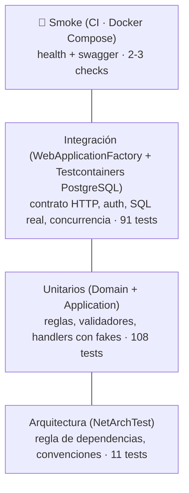

# Estándares de Código, Patrones y Testing

> **Documento:** `docs/coding-standards.md` · **Estado:** Vigente (aplicado en v1.0) · **Versión:** 1.1  
> **Relacionados:** [Requerimientos](requirements.md) · [Arquitectura](architecture.md) · [Roadmap y tareas](roadmap-and-tasks.md)

Estas normas existen para que el código sea **predecible**: cualquier revisor (o entrevistador) debe poder abrir un archivo y saber dónde está cada cosa y por qué. Lo que puede comprobar una herramienta, lo comprueba una herramienta (`.editorconfig`, analizadores, `dotnet format`, tests de arquitectura); este documento cubre el resto.

## 1. Configuración base del repositorio

```xml
<!-- Directory.Build.props -->
<Project>
  <PropertyGroup>
    <TargetFramework>net10.0</TargetFramework>
    <LangVersion>latest</LangVersion>
    <Nullable>enable</Nullable>
    <ImplicitUsings>enable</ImplicitUsings>
    <TreatWarningsAsErrors>true</TreatWarningsAsErrors>
    <AnalysisLevel>latest-recommended</AnalysisLevel>
    <EnforceCodeStyleInBuild>true</EnforceCodeStyleInBuild>
    <GenerateDocumentationFile>true</GenerateDocumentationFile>
    <NoWarn>$(NoWarn);CS1591;CS1573</NoWarn> <!-- XML docs solo donde aportan (API pública/OpenAPI) -->
  </PropertyGroup>
</Project>
```

- **Versiones centralizadas** en `Directory.Packages.props` (`ManagePackageVersionsCentrally=true`).
- **SDK fijado** en `global.json` (`rollForward: latestFeature`).
- **`.editorconfig`** es la fuente de verdad de estilo; `dotnet format --verify-no-changes` corre en CI.

## 2. Estilo C#

### 2.1 Nomenclatura

| Elemento | Convención | Ejemplo |
|---|---|---|
| Namespaces | File-scoped, reflejan carpeta | `namespace Leaderboard.Application.Scores.SubmitScore;` |
| Clases, records, enums, métodos, propiedades | `PascalCase` | `LeaderboardEntry`, `GetTopAsync` |
| Interfaces | Prefijo `I` | `IGameRepository` |
| Parámetros y locales | `camelCase` | `gameId`, `pageSize` |
| Campos privados | `_camelCase` | `_timeProvider` |
| Constantes | `PascalCase` | `MaxPageSize` |
| Métodos asíncronos | Sufijo `Async` | `SubmitAsync` |
| Casos de uso | `Verbo + Sustantivo` + `Command`/`Query` + `Handler` | `SubmitScoreCommand`, `SubmitScoreCommandHandler` |
| DTOs HTTP | `…Request` / `…Response` | `RegisterPlayerRequest`, `PlayerRankResponse` |
| Errores de dominio | Clase estática `…Errors` | `ScoreErrors.OutOfRange` |
| Tests | `Metodo_Escenario_ResultadoEsperado` | `Submit_WhenScoreExceedsMax_ReturnsOutOfRange` |

### 2.2 Reglas de lenguaje

- **`sealed` por defecto** para clases que no están diseñadas para herencia (handlers, servicios, endpoints, entidades concretas).
- **`record`/`record struct`** para DTOs, comandos, consultas y Value Objects; **inmutables** (`init`).
- **Constructores primarios** para inyección de dependencias en servicios; no para entidades (necesitan validación).
- **Nullable reference types** activo: prohibido `!` (null-forgiving) salvo en tests o con comentario que justifique.
- **`var`** cuando el tipo es evidente en la parte derecha; tipo explícito en caso contrario.
- **Colecciones:** exponer `IReadOnlyList<T>`/`IReadOnlyCollection<T>`; usar *collection expressions* (`[]`).
- **Sin «magic numbers»:** límites como `MaxPageSize = 100`, `SignatureWindow = TimeSpan.FromSeconds(300)` en constantes u `Options`.
- **Tiempo:** nunca `DateTime.Now`/`UtcNow`; siempre `TimeProvider` inyectado. Tipos `DateTimeOffset` en UTC.
- **Identificadores:** `Guid.CreateVersion7()` generado en el dominio (no en la BD) para conocer el ID antes de persistir.
- **Tamaño:** métodos ≤ ~30 líneas; clases con una responsabilidad. Un tipo público por archivo.
- **Comentarios:** explican el *por qué*, no el *qué*. XML docs en endpoints/DTOs (alimentan OpenAPI).

### 2.3 Asincronía

- `async` de extremo a extremo; prohibido `.Result`, `.Wait()` y `async void`.
- **`CancellationToken` obligatorio** como último parámetro en todo método asíncrono de Application e Infrastructure, propagado hasta EF Core.
- Sin `ConfigureAwait(false)` en código de aplicación ASP.NET Core (no hay `SynchronizationContext`).

## 3. Patrones aplicados

### 3.1 CQRS liviano (sin bus ni MediatR)

Comandos y consultas son tipos distintos con handlers distintos. **No** hay mediador: el endpoint recibe el handler por DI. Los aspectos transversales (validación, logging) se añaden con **decoradores** (Scrutor).

```csharp
public interface ICommandHandler<in TCommand, TResponse> where TCommand : ICommand<TResponse>
{
    Task<Result<TResponse>> HandleAsync(TCommand command, CancellationToken ct);
}

public sealed record SubmitScoreCommand(Guid GameId, Guid ApiKeyId, Guid PlayerId, long Value, string Nonce)
    : ICommand<SubmitScoreResponse>;
```

| Lado | Pasa por | Acceso a datos | Tracking |
|---|---|---|---|
| **Command** | Validador → Handler → Agregado de dominio → Repositorio → `IUnitOfWork.SaveChangesAsync` | Repositorios | Sí |
| **Query** | Validador → Handler → Read service | Proyección LINQ (`Select` a DTO) o SQL | `AsNoTracking` |

> **Por qué no MediatR:** licencia comercial desde v13 y la indirección (`ISender.Send`) oculta qué se ejecuta. Inyectar el handler es igual de desacoplado y se navega con *Go to definition*.

### 3.2 Repository (+ Specification solo donde aporta)

- **Un repositorio por agregado raíz** (`IPlayerRepository`, `IGameRepository`, `IScoreRepository`), interfaz en Application, implementación en Infrastructure.
- Métodos con **intención de negocio**, no CRUD genérico: `GetOwnedByAsync(gameId, ownerId, ct)`, `ExistsWithSlugAsync(slug, ct)`, `CountActiveKeysAsync(gameId, ct)`.
- **No** hay `IRepository<T>` genérico que exponga `IQueryable` (filtraría EF a Application).
- **Specification**: se usa solo para filtros combinables reutilizados (p. ej. `ActiveGamesSpec` + `SearchByNameSpec` en el listado de juegos). Implementación mínima propia (`Expression<Func<T,bool>>` + `ApplySpecification`), sin librería.
- **Lecturas de ranking** fuera del patrón repositorio: `ILeaderboardReadService` con consultas específicas y optimizadas (ver arquitectura §3.4).

### 3.3 Result pattern y errores de dominio

```csharp
public enum ErrorType { Validation, NotFound, Conflict, Unauthorized, Forbidden, BusinessRule }

public sealed record Error(string Code, string Description, ErrorType Type);

public static class ScoreErrors
{
    public static Error OutOfRange(long value, long max) =>
        new("score.out_of_range", $"Score {value} exceeds the maximum of {max}.", ErrorType.BusinessRule);
}
```

- **Errores esperados** (reglas de negocio, no encontrado, conflicto) → `Result<T>.Failure(error)`. Nunca excepciones para control de flujo.
- **Mapeo único** `ErrorType → HTTP` en la capa Api:

| `ErrorType` | HTTP |
|---|---|
| `Validation` | 400 |
| `Unauthorized` | 401 |
| `Forbidden` | 403 |
| `NotFound` | 404 |
| `Conflict` | 409 |
| `BusinessRule` | 422 |

### 3.4 Gestión de excepciones

| Situación | Tratamiento |
|---|---|
| Invariante de dominio violada por un bug (p. ej. constructor con estado imposible) | `throw` de `DomainException` → llega al handler global → `500` (es un bug, no un error del usuario) |
| `DbUpdateException` por violación `UNIQUE` en carrera | Capturada **en el repositorio**, traducida a `Result` con `Conflict` (p. ej. `game.slug_taken`) o a respuesta idempotente (nonce) |
| `DbUpdateConcurrencyException` (`xmin`) | Traducida a `412 concurrency.conflict` |
| `OperationCanceledException` por cancelación del cliente | No se registra como error; respuesta `499` (log `Information`) |
| Cualquier otra excepción | `GlobalExceptionHandler : IExceptionHandler` → log `Error` con contexto → `500 server.unexpected` con `traceId`; detalles solo en Development |

Reglas:

- **Nunca** `catch (Exception)` salvo en el handler global y en el *bootstrap* de `Program.cs`.
- **Nunca** tragarse una excepción: se traduce, se registra o se relanza (`throw;`, no `throw ex;`).
- **Guard clauses** con `ArgumentNullException.ThrowIfNull` / `ArgumentOutOfRangeException.ThrowIfNegative` en constructores de dominio.

### 3.5 ProblemDetails (RFC 9457)

- `builder.Services.AddProblemDetails(o => o.CustomizeProblemDetails = ctx => { /* traceId, code, instance */ })`.
- `app.UseExceptionHandler()` + `app.UseStatusCodePages()` para que **incluso** los `401/404/405` del framework salgan como `application/problem+json`.
- `code` estable y documentado (catálogo en arquitectura §4.3). Cambiar un `code` es un **breaking change**.
- Los mensajes (`title`, `detail`) están en inglés (convención de API pública); la documentación del proyecto, en español.

### 3.6 Validación (FluentValidation)

- Un validador por Request/Command, en la misma carpeta del caso de uso: `SubmitScoreCommandValidator`.
- Validación **sintáctica** (formato, longitudes, rangos genéricos) en validadores; validación **semántica** que requiere estado (slug único, score dentro del rango del juego) en el handler/dominio.
- Ejecutada por un **decorador** de Application (`ValidationCommandDecorator`/`ValidationQueryDecorator`) antes de cada handler: cualquier punto de entrada (HTTP, tests, futuros consumidores) queda validado igual. Devuelve un `ValidationError` que la Api traduce a `ValidationProblemDetails`. **Sin** validación automática por reflexión (`FluentValidation.AspNetCore` está deprecado).
- Mensajes con `WithErrorCode` cuando el cliente necesita distinguirlos.

### 3.7 Endpoints (Minimal APIs)

```csharp
public sealed class LeaderboardEndpoints : IEndpointGroup
{
    public void Map(IEndpointRouteBuilder app)
    {
        var group = app.MapGroup("/api/v1/games/{gameId:guid}/leaderboard")
                       .WithTags("Leaderboard")
                       .RequireRateLimiting(RateLimitPolicies.PublicRead)
                       .AllowAnonymous();

        group.MapGet("/top", GetTopAsync)
             .WithName("GetTopScores")
             .WithSummary("Returns the top N players of a game.")
             .Produces<IReadOnlyList<LeaderboardEntryResponse>>()
             .ProducesValidationProblem()
             .ProducesProblem(StatusCodes.Status404NotFound);
    }

    private static async Task<IResult> GetTopAsync(
        Guid gameId, [AsParameters] TopQueryParameters query,
        IQueryHandler<GetTopQuery, IReadOnlyList<LeaderboardEntryResponse>> handler, CancellationToken ct)
        => (await handler.HandleAsync(new GetTopQuery(gameId, query.N), ct)).ToHttpResult();
}
```

- Un archivo `…Endpoints` por feature; **sin lógica de negocio** (binding → handler → `ToHttpResult()`).
- Toda ruta declara `Produces…` para un contrato OpenAPI completo.
- Autorización declarada en el grupo; `AllowAnonymous` siempre explícito.

### 3.8 EF Core

- Configuración con `IEntityTypeConfiguration<T>` (nada de *data annotations* en el dominio).
- Nombres `snake_case` (`UseSnakeCaseNamingConvention`).
- Consultas de lectura: `AsNoTracking()` + proyección `Select` a DTO; nunca devolver entidades por HTTP.
- Prohibido *lazy loading*; `Include` solo en comandos que lo necesiten.
- SQL crudo solo en read services / upsert, **siempre parametrizado** (`FromSql($"…")` interpolado seguro o `NpgsqlParameter`), nunca concatenado.
- Una migración por cambio de modelo, con nombre descriptivo (`AddNonceToScores`), revisada en el PR.

### 3.9 Logging (Serilog)

- **Plantillas de mensaje**, no interpolación: `logger.LogInformation("Score {ScoreId} accepted for game {GameId}", …)`.
- Preferir `LoggerMessage` source generators (`[LoggerMessage]`) en rutas calientes.
- **Nunca** registrar: contraseñas, tokens, secretos de API Key, firma HMAC, email. Registrar `keyId`/`playerId` es aceptable.
- Niveles: `Debug` (diagnóstico), `Information` (eventos de negocio), `Warning` (rechazos de seguridad, reintentos), `Error` (excepciones no controladas), `Fatal` (arranque fallido).

## 4. Estrategia de testing

### 4.1 Pirámide



| Tipo | Proyecto | Qué cubre | Herramientas | Objetivo |
|---|---|---|---|---|
| Unitario | `*.Domain.UnitTests`, `*.Application.UnitTests` | Invariantes, `IsBetter`/`RankKey`, validadores, handlers | xUnit v3, Shouldly, NSubstitute, `FakeTimeProvider` | ≥ 80 % líneas en Domain+Application; < 5 s |
| Integración | `*.Api.IntegrationTests` | Endpoints extremo a extremo, códigos HTTP, ProblemDetails, auth JWT y HMAC, SQL de ranking, concurrencia | `WebApplicationFactory<Program>`, Testcontainers.PostgreSql, Respawn | Cada endpoint: camino feliz + errores principales |
| Arquitectura | `*.ArchitectureTests` | Regla de dependencias, `sealed`, sufijos | NetArchTest.Rules | 100 % verde siempre |
| Smoke | Job CI `docker` | Imagen arranca, `ready` + Swagger | `docker compose up --wait`, `curl` | Cada PR |
| Carga | `perf/k6` | RNF-01 | k6 | Manual antes de `v1.0.0` |

### 4.2 Reglas de tests

- Estructura **Arrange / Act / Assert** separada por líneas en blanco; un comportamiento por test.
- **Sin InMemory provider ni SQLite**: la integración usa PostgreSQL real (el SQL de ranking es específico de PostgreSQL).
- Tests **independientes y en paralelo** entre colecciones; BD reseteada con Respawn.
- Datos con **builders** y valores explícitos relevantes; nada de datos «mágicos» compartidos.
- Tiempo controlado con `FakeTimeProvider` (expiración JWT, ventana HMAC, desempates).
- **Un bug = un test** que lo reproduce antes del fix.
- Prohibido `Thread.Sleep`/`Task.Delay` para sincronizar.
- Los tests nunca se desactivan para «poner CI en verde»; un test inestable se arregla o se abre issue bloqueante.

```csharp
[Fact]
public async Task SubmitScore_WhenBetterThanPersonalBest_UpdatesRankAndReturnsPersonalBest()
{
    // Arrange
    var game = await _api.CreateGameAsync(scoreOrder: ScoreOrder.HigherIsBetter);
    var player = await _api.RegisterPlayerAsync();
    var client = _api.CreateGameServerClient(game.ApiKey);
    await client.SubmitScoreAsync(game.Id, player.Id, value: 5_000);

    // Act
    var response = await client.SubmitScoreAsync(game.Id, player.Id, value: 7_200);

    // Assert
    response.StatusCode.ShouldBe(HttpStatusCode.Created);
    var body = await response.ReadAsAsync<SubmitScoreResponse>();
    body.IsPersonalBest.ShouldBeTrue();
    body.BestScore.ShouldBe(7_200);
    body.Rank.ShouldBe(1);
}
```

### 4.3 Tests de arquitectura (ejemplo)

```csharp
[Fact]
public void Domain_ShouldNotDependOnAnyOtherLayer() =>
    Types.InAssembly(DomainAssembly)
         .ShouldNot().HaveDependencyOnAny("Leaderboard.Application", "Leaderboard.Infrastructure",
                                          "Leaderboard.Api", "Microsoft.EntityFrameworkCore")
         .GetResult().IsSuccessful.ShouldBeTrue();
```

## 5. Seguridad en el código

- Comparaciones de secretos con `CryptographicOperations.FixedTimeEquals`.
- Aleatoriedad criptográfica con `RandomNumberGenerator` (nunca `Random`).
- Contraseñas con `PasswordHasher<T>` (PBKDF2); nunca algoritmos propios.
- Opciones sensibles con `IOptions<T>` + `ValidateDataAnnotations().ValidateOnStart()` (la app no arranca con una clave JWT corta).
- DTOs de entrada explícitos (no enlazar entidades) para evitar *mass assignment*.
- Límites de tamaño en toda entrada variable (strings, `metadata`, paginación).

## 6. Git, revisiones y calidad

- **Conventional Commits** con *scope* por feature: `feat(leaderboard): add around-player endpoint`.
- PR pequeño (idealmente < 400 líneas de diff), con descripción *qué/por qué/cómo probar* y enlace al issue (`Closes #…`).
- **Checklist de PR:**
  - [ ] Tests nuevos/actualizados y en verde
  - [ ] Sin warnings; `dotnet format` aplicado
  - [ ] Contrato OpenAPI revisado (códigos de respuesta, ejemplos)
  - [ ] Nuevos `code` de error añadidos al catálogo
  - [ ] Sin secretos ni datos personales en código/logs
  - [ ] Migración revisada (si aplica)
  - [ ] Documentación / ADR actualizada (si cambia una decisión)

## 7. Dependencias aprobadas

| Propósito | Paquete | Licencia | Capa |
|---|---|---|---|
| ORM / PostgreSQL | `Microsoft.EntityFrameworkCore`, `Npgsql.EntityFrameworkCore.PostgreSQL`, `EFCore.NamingConventions` | MIT / PostgreSQL / Apache-2.0 | Infrastructure |
| JWT | `Microsoft.AspNetCore.Authentication.JwtBearer` | MIT | Api / Infrastructure |
| Hash de contraseñas | `PasswordHasher<T>` (framework compartido `Microsoft.AspNetCore.App`, sin paquete extra) | MIT | Infrastructure |
| Key ring en base de datos | `Microsoft.AspNetCore.DataProtection.EntityFrameworkCore` | MIT | Infrastructure |
| Validación | `FluentValidation`, `FluentValidation.DependencyInjectionExtensions` | Apache-2.0 | Application |
| DI scanning / decoradores | `Scrutor` | MIT | Application / Api |
| OpenAPI | `Microsoft.AspNetCore.OpenApi`, `Swashbuckle.AspNetCore.SwaggerUI` | MIT | Api |
| Logging | `Serilog.AspNetCore`, `Serilog.Formatting.Compact` | Apache-2.0 | Api |
| Health checks | `Microsoft.Extensions.Diagnostics.HealthChecks.EntityFrameworkCore` | MIT | Api |
| Tests | `xunit.v3`, `Shouldly`, `NSubstitute`, `Testcontainers.PostgreSql`, `Respawn`, `NetArchTest.Rules`, `Microsoft.AspNetCore.Mvc.Testing`, `Microsoft.Extensions.TimeProvider.Testing`, `Microsoft.Testing.Extensions.CodeCoverage` (runner: Microsoft.Testing.Platform) | Apache-2.0 / BSD / MIT | tests |

Herramientas locales (`dotnet-tools.json`): `dotnet-ef` (migraciones) y `dotnet-reportgenerator-globaltool` (informe de cobertura fusionado).

Añadir una dependencia nueva requiere justificarla en el PR (propósito, licencia, mantenimiento activo).
