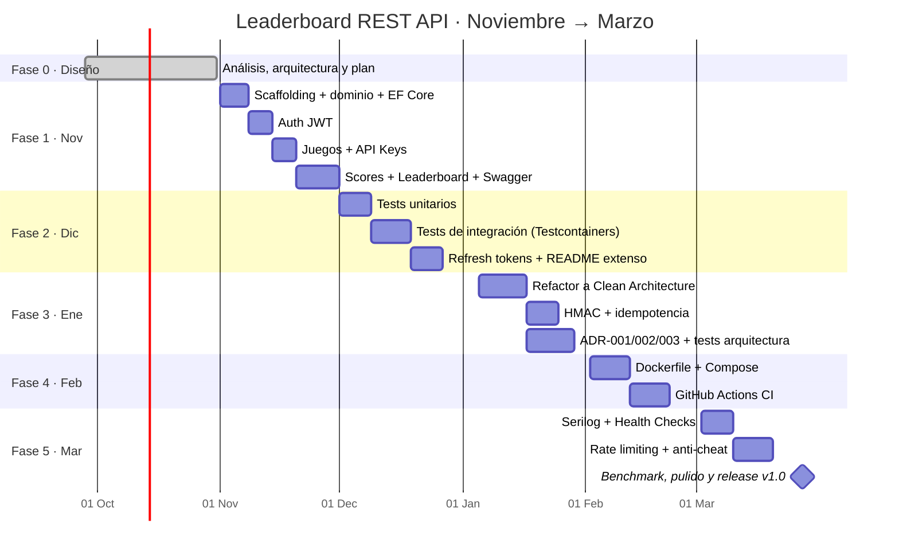

# Roadmap y Plan de Tareas

> **Documento:** `docs/roadmap-and-tasks.md` · **Estado:** Fases 1–5 implementadas y fusionadas en `main` (quedan tareas de publicación en GitHub) · **Versión:** 1.0  
> **Relacionados:** [Requerimientos](requirements.md) · [Arquitectura](architecture.md) · [Estándares de código](coding-standards.md)

## 1. Visión temporal

| Fase | Mes | Objetivo | Entregable demostrable | Tag |
|---|---|---|---|---|
| 0 | Sep–Oct | Diseño completo antes de escribir código | Este conjunto de documentos | `v0.0-design` |
| 1 | Nov | Base funcional con endpoints mínimos | Swagger local: registro → login → juego → API Key → score → ranking | `v0.1.0` |
| 2 | Dic | Confianza: tests + documentación | Suite verde (unit + integración) y README extenso | `v0.2.0` |
| 3 | Ene | Arquitectura sostenible | 4 proyectos Clean Architecture, 3 ADR, HMAC activo | `v0.3.0` |
| 4 | Feb | Reproducibilidad | `docker compose up` + CI verde en cada PR | `v0.4.0` |
| 5 | Mar | Producción-ready | Logs estructurados, health checks, rate limiting, benchmark | `v1.0.0` |

---

> **Nota de ejecución.** Las fases 1–5 se implementaron de forma consecutiva en la rama `claude/leaderboard-implementation`, con un commit por fase. Al no existir un periodo de uso entre fases, la Fase 1 se construyó directamente con la estructura de Clean Architecture (la Fase 3 aportó los tests de arquitectura y los ADR en lugar de un refactor), y el benchmark de la Fase 5 obligó a rediseñar el índice de ranking ([performance.md](performance.md)).

## 2. Forma de trabajo

- **Gestión:** un *GitHub Issue* por tarea (IDs de este documento en el título, p. ej. `[N-12] Endpoint Top N`), agrupados en un *Milestone* por fase y un *Project board* (Backlog → In progress → Review → Done).
- **Ramas:** *trunk-based* con ramas cortas `feat/…`, `fix/…`, `docs/…`, `test/…`; PR obligatorio a `main` con CI verde (desde Febrero, *branch protection*).
- **Commits:** [Conventional Commits](https://www.conventionalcommits.org/) (`feat(scores): submit score endpoint`).
- **Definition of Done por tarea:** código + tests relevantes + Swagger actualizado + sin warnings + documentación afectada actualizada.
- **Estimación:** tamaños S (≤ 2 h), M (≤ ½ día), L (≤ 1 día). Ninguna tarea L sin dividir si supera 1 día.

---

## 3. Fase 0 · Septiembre–Octubre — Análisis y diseño ✅

- [x] **F0-01** Análisis de requerimientos (RF, RNF, historias Gherkin) — `docs/requirements.md`
- [x] **F0-02** Arquitectura objetivo, modelo de datos, contrato REST, seguridad — `docs/architecture.md`
- [x] **F0-03** Plan de fases y tareas — `docs/roadmap-and-tasks.md`
- [x] **F0-04** Estándares de código y testing — `docs/coding-standards.md`
- [x] **F0-05** Generador de documentación HTML navegable — `scripts/build_docs.py`
- [ ] **F0-06** Crear Milestones, labels (`type:feat`, `area:auth`, `phase:nov`…) e Issues a partir de este documento — *pendiente: requiere configurar el repositorio en GitHub*

---

## 4. Fase 1 · Noviembre — Base funcional + Swagger

**Objetivo:** flujo completo usable desde Swagger contra PostgreSQL local.
**Estructura:** un único proyecto `Leaderboard.Api` con carpetas `Domain/`, `Application/`, `Infrastructure/`, `Endpoints/` (prepara el refactor de Enero).

### 4.1 Scaffolding y fundamentos

- [x] **N-01** (S) `global.json` fijando SDK .NET 10 LTS; solución `Leaderboard.sln`; `.gitignore`, `.editorconfig`
- [x] **N-02** (S) `Directory.Build.props` (`Nullable`, `ImplicitUsings`, `TreatWarningsAsErrors`, `AnalysisLevel=latest-recommended`) y `Directory.Packages.props` (gestión central de versiones)
- [x] **N-03** (S) Proyecto `Leaderboard.Api` (Minimal APIs) con carpetas por capa
- [x] **N-04** (S) `compose.yaml` mínimo **solo con PostgreSQL** para desarrollo local (la API corre con `dotnet run`)
- [x] **N-05** (M) OpenAPI (`Microsoft.AspNetCore.OpenApi`) + Swagger UI en `/swagger` (solo Development) con esquema Bearer
- [x] **N-06** (M) ProblemDetails global: `AddProblemDetails` + `IExceptionHandler` + `traceId` + `code`
- [x] **N-07** (M) Tipos base: `Result<T>`, `Error`, `ErrorType` y extensión `Result → IResult`
- [x] **N-08** (S) `PagedResult<T>` + `PageRequest` con validación (`page ≥ 1`, `1 ≤ pageSize ≤ 100`)
- [x] **N-09** (S) FluentValidation + filtro de endpoint `ValidationFilter<T>` → `ValidationProblemDetails`

### 4.2 Dominio y persistencia

- [x] **N-10** (M) Entidades de dominio: `Player`, `Game` (con `ScoreOrder`, `ScoreRange`), `GameApiKey`, `Score`, `LeaderboardEntry` + tests de invariantes básicos
- [x] **N-11** (M) `AppDbContext` + `IEntityTypeConfiguration<T>` por entidad (snake_case con `EFCore.NamingConventions`, `citext`, `xmin`)
- [x] **N-12** (M) Migración inicial `InitialCreate` con índices de la sección 3.3 de arquitectura
- [x] **N-13** (S) Aplicar migraciones al arrancar si `Database:MigrateOnStartup=true`
- [ ] **N-14** (S) Seed opcional de datos de demo (juego + 50 jugadores) en Development — *parcial: solo el administrador (`Seed:Admin`); los datos masivos están en `perf/seed.sql`*

### 4.3 Autenticación (RF-01, RF-02, RF-05, RF-06)

- [x] **N-15** (M) `POST /auth/register` con `PasswordHasher<Player>`, unicidad email/username → `409`
- [x] **N-16** (M) `JwtTokenService` (HS256, 15 min, claims `sub`, `unique_name`, `role`, `jti`) + opciones validadas al arrancar (`ValidateOnStart`)
- [x] **N-17** (S) `POST /auth/login` con error genérico `auth.invalid_credentials`
- [x] **N-18** (S) `GET /players/me`
- [x] **N-19** (S) Swagger: botón *Authorize* funcional con Bearer

### 4.4 Juegos y API Keys (RF-10…RF-15)

- [x] **N-20** (M) `POST /games`, `GET /games` (paginado + `search`), `GET /games/{id}`
- [x] **N-21** (M) Política `GameOwner` (autorización por recurso, `404` si no es propietario)
- [x] **N-22** (S) `PATCH /games/{id}` y `DELETE /games/{id}` (archivar)
- [x] **N-23** (M) Emisión de API Key: `keyId` (`lbk_` + 16 chars), secreto 256 bits (`RandomNumberGenerator`), cifrado con Data Protection; secreto devuelto una sola vez
- [x] **N-24** (S) Listar y revocar API Keys
- [x] **N-25** (M) `ApiKeyAuthenticationHandler` modo simple (`X-Api-Key: keyId.secret`, `FixedTimeEquals`) + política `GameServer`

### 4.5 Scores y Leaderboard (RF-20…RF-27)

- [x] **N-26** (L) `POST /games/{id}/scores`: validación de rango, juego activo, jugador existente; transacción con INSERT score + upsert `ON CONFLICT` de `leaderboard_entries`
- [x] **N-27** (M) Respuesta con `isPersonalBest`, `bestScore`, `rank`, `totalPlayers`
- [x] **N-28** (M) `LeaderboardReadService`: Top N y ranking paginado con `rank_key` normalizado y desempate
- [x] **N-29** (M) Posición absoluta (rango + percentil)
- [x] **N-30** (M) Ventana relativa (`around?range=k`) con dos consultas keyset
- [x] **N-31** (S) Ejemplos y descripciones OpenAPI en todos los endpoints (`WithSummary`, `Produces<ProblemDetails>`)

### 4.6 Cierre de fase

- [x] **N-32** (S) Colección `.http` (`src/Leaderboard.Api/Leaderboard.Api.http`) con el flujo de demo (el envío firmado se hace con Swagger UI o `samples/`)
- [x] **N-33** (S) README: sección «Cómo ejecutar» (versión provisional con `dotnet run`)
- [ ] **N-34** (S) Tag `v0.1.0` + nota de release — *pendiente: etiquetar al fusionar en `main`*

**✅ Criterio de salida:** desde Swagger se completa registro → login → crear juego → emitir clave → enviar 3 scores (con la clave) → Top N y posición correctos.

---

## 5. Fase 2 · Diciembre — Tests + documentación extensa

**Objetivo:** red de seguridad antes del refactor de Enero (los tests de integración son el contrato que el refactor no puede romper).

### 5.1 Infraestructura de tests

- [x] **D-01** (S) Proyectos `Leaderboard.UnitTests` y `Leaderboard.IntegrationTests` (xUnit v3, Shouldly, NSubstitute, coverlet)
- [x] **D-02** (M) `ApiFactory : WebApplicationFactory<Program>, IAsyncLifetime` con **Testcontainers PostgreSQL** (un contenedor por colección)
- [x] **D-03** (M) **Respawn** para limpiar la BD entre tests; builders de datos (`PlayerBuilder`, `GameBuilder`) y helpers `AuthenticateAsAsync(...)`, `CreateApiKeyAsync(...)`
- [x] **D-04** (S) `FakeTimeProvider` registrado en tests para controlar tiempo (expiración de tokens, desempates)

### 5.2 Tests unitarios

- [x] **D-05** (M) Dominio: `Game.IsBetter(a, b)`, `ScoreRange`, `RankKey` para ambos `ScoreOrder`, invariantes de `Player`/`Game`
- [x] **D-06** (M) Validadores FluentValidation (casos límite de username, password, paginación, `n`, `range`)
- [x] **D-07** (M) Handlers de aplicación con repositorios falsos (registro duplicado, juego archivado, fuera de rango)
- [x] **D-08** (S) `JwtTokenService` (claims, expiración) y generación/verificación de API Keys

### 5.3 Tests de integración (una clase por feature)

- [x] **D-09** (M) Auth: registro, duplicados, login OK/KO, `/players/me` con y sin token
- [x] **D-10** (M) Games: CRUD, BOLA (otro usuario → `404`), archivado
- [x] **D-11** (M) API Keys: emisión (secreto solo una vez), listado sin secreto, revocación → `401`
- [x] **D-12** (L) Scores: récord personal, score peor, fuera de rango, juego archivado, clave de otro juego (`403`)
- [x] **D-13** (L) Leaderboard: Top N con empates, `LowerIsBetter`, paginación, bordes de la ventana relativa, percentil
- [x] **D-14** (M) **Concurrencia**: 50 envíos paralelos del mismo jugador → una sola entrada con el máximo correcto (RNF-07)
- [x] **D-15** (S) Contrato de errores: todas las respuestas 4xx/5xx son `application/problem+json` con `traceId` y `code`
- [x] **D-16** (S) El documento OpenAPI se genera sin errores (`GET /openapi/v1.json` → 200)

### 5.4 Funcionalidad y documentación

- [x] **D-17** (M) Refresh tokens con rotación y detección de reutilización (RF-03) + `POST /auth/logout` (RF-04)
- [x] **D-18** (S) `GET /leaderboard/me` y `GET /players/me/scores` (RF-28)
- [x] **D-19** (M) README extenso: arquitectura, decisiones, ejemplos `curl`, cómo ejecutar tests, badges
- [x] **D-20** (S) Informe de cobertura (ReportGenerator) y umbral objetivo documentado
- [ ] **D-21** (S) Tag `v0.2.0` — *pendiente: etiquetar al fusionar en `main`*

**✅ Criterio de salida:** `dotnet test` verde en local; cobertura Domain+Application ≥ 70 % (objetivo final 80 %).

---

## 6. Fase 3 · Enero — Clean Architecture + ADRs

**Objetivo:** separar en 4 proyectos **sin cambiar el comportamiento externo** (los tests de integración de Diciembre son el árbitro).

### 6.1 Refactor

- [x] **E-01** (M) Crear `Leaderboard.Domain` y mover entidades/VOs/errores (sin dependencias NuGet)
- [x] **E-02** (L) Crear `Leaderboard.Application`: mover handlers, DTOs, validadores; definir puertos (`IPlayerRepository`, `IGameRepository`, `IScoreRepository`, `IUnitOfWork`, `ILeaderboardReadService`, `ITokenService`, `ICurrentUser`)
- [x] **E-03** (M) Abstracciones CQRS liviano (`ICommand<T>`, `ICommandHandler<,>`, `IQuery<T>`, `IQueryHandler<,>`) + registro por *assembly scanning* (Scrutor) + decoradores de validación y logging
- [x] **E-04** (L) Crear `Leaderboard.Infrastructure`: `AppDbContext`, configuraciones, migraciones, repositorios, read services, seguridad; `AddInfrastructure(IConfiguration)`
- [x] **E-05** (M) Adelgazar `Leaderboard.Api`: solo endpoints, auth handlers, error handling, composición
- [x] **E-06** (M) Separar tests: `Domain.UnitTests`, `Application.UnitTests`, `Api.IntegrationTests`
- [x] **E-07** (M) `Leaderboard.ArchitectureTests` con NetArchTest: Domain sin dependencias; Application no referencia Infrastructure/EF/AspNetCore; handlers `sealed`; endpoints no referencian `DbContext`

### 6.2 Anti-cheat (primera parte)

- [x] **E-08** (L) `ApiKeyHmacAuthenticationHandler`: cadena canónica, ventana ±300 s, `FixedTimeEquals`; flag `ApiKeys:AllowPlainSecret`
- [x] **E-09** (M) Idempotencia por `UNIQUE(api_key_id, nonce)`: reintento → `200` con resultado original (RF-29)
- [x] **E-10** (S) Límite de 5 claves activas por juego (RF-16)
- [x] **E-11** (S) Scripts de ejemplo que firman peticiones: `samples/submit-score.sh` (bash + openssl) y `samples/submit-score.ps1` (PowerShell 7)
- [x] **E-12** (M) Tests de integración HMAC: firma alterada, cuerpo alterado, timestamp caducado, replay, clave revocada

### 6.3 ADRs

- [x] **E-13** (M) `docs/adr/0001-postgresql.md` — PostgreSQL vs SQL Server vs MongoDB vs Redis-first
- [x] **E-14** (M) `docs/adr/0002-clean-architecture.md` — Clean vs Vertical Slice vs N-capas; coste/beneficio del refactor
- [x] **E-15** (M) `docs/adr/0003-anti-cheat.md` — API Key simple vs HMAC vs JWT de servidor vs mTLS; rate limiting; plausibilidad
- [x] **E-16** (S) Actualizar `docs/architecture.md` si alguna decisión cambió; regenerar HTML
- [ ] **E-17** (S) Tag `v0.3.0` — *pendiente: etiquetar al fusionar en `main`*

**✅ Criterio de salida:** 4 proyectos, tests de arquitectura verdes, todos los tests de Diciembre verdes sin modificar sus aserciones, 3 ADR publicados.

---

## 7. Fase 4 · Febrero — Docker + CI

### 7.1 Containerización

- [x] **F-01** (M) `Dockerfile` multi-stage: restore cacheado (copiar `*.csproj` primero), `publish -c Release`, runtime `aspnet:10.0-noble-chiseled`, usuario no root, `EXPOSE 8080`
- [x] **F-02** (S) `.dockerignore` (bin/obj, tests, docs, `.git`)
- [x] **F-03** (M) `compose.yaml`: `api` + `postgres:18-alpine`, `healthcheck` con `pg_isready`, `depends_on: service_healthy`, volúmenes `pgdata` (montado en `/var/lib/postgresql`, nuevo layout de la imagen oficial desde PG 18) y `dp-keys`, `.env.example`
- [x] **F-04** (S) Swagger accesible en `http://localhost:8080/swagger` con `ASPNETCORE_ENVIRONMENT=Development` en Compose
- [x] **F-05** (S) pgAdmin opcional con servidor preconfigurado: `docker compose --profile tools up -d` → `http://localhost:5050`
- [ ] **F-06** (S) Verificar el criterio de aceptación desde un clon limpio en otra máquina/VM — *pendiente: lo cubre el job `docker` del CI en cada PR; falta la verificación manual en otra máquina*

### 7.2 Integración continua

- [x] **F-07** (M) `.github/workflows/ci.yml`: disparadores `push` a `main` y `pull_request`; `actions/setup-dotnet` con `global.json`; caché de NuGet
- [x] **F-08** (S) Pasos: `dotnet restore` → `dotnet format --verify-no-changes` → `dotnet build -c Release --no-restore` → `dotnet test --no-build`
- [x] **F-09** (S) Tests de integración con Testcontainers en `ubuntu-latest` (Docker disponible en el runner)
- [x] **F-10** (S) Publicar resultados de tests (TRX) y cobertura como artefactos; umbral de cobertura que falla el job
- [x] **F-11** (M) Job `docker`: `docker build` + *smoke test* (`docker compose up -d --wait` + `curl /health/ready` + `curl /swagger/index.html`)
- [x] **F-12** (S) Job de seguridad: `dotnet list package --vulnerable --include-transitive` que falle ante vulnerabilidades *High*
- [ ] **F-13** (S) Dependabot (NuGet, GitHub Actions, Docker) + *branch protection* en `main` — *parcial: Dependabot configurado; la protección de rama se activa en los ajustes de GitHub*
- [x] **F-14** (S) Job `docs`: regenerar HTML (`python scripts/build_docs.py`) y fallar si hay diferencias (`git diff --exit-code docs/`)
- [ ] **F-15** (S) Badges de CI y cobertura en README; tag `v0.4.0` — *parcial: badge de CI añadido; falta el tag*

**✅ Criterio de salida:** clon limpio → `docker compose up` → Swagger operativo; CI verde en `main` y en PRs.

---

## 8. Fase 5 · Marzo — Observabilidad y resiliencia

### 8.1 Logging estructurado

- [x] **M-01** (M) Serilog: `builder.Services.AddSerilog(...)` configurado desde `appsettings`, salida `CompactJsonFormatter` a consola; *bootstrap logger* para errores de arranque
- [x] **M-02** (S) `UseSerilogRequestLogging` con `EnrichDiagnosticContext` (`ApiKeyId`, `PlayerId`, `GameId` cuando existan)
- [x] **M-03** (S) Filtro/destructuring que impide registrar contraseñas, tokens, secretos y emails
- [x] **M-04** (S) Decorador de logging en handlers (duración, resultado, `code` de error)
- [x] **M-05** (S) Test: el `traceId` del ProblemDetails de un 500 aparece en el log (sink en memoria)

### 8.2 Health checks

- [x] **M-06** (S) `/health/live` (sin dependencias) y `/health/ready` (PostgreSQL) con *tags* y writer JSON
- [x] **M-07** (S) `HEALTHCHECK` en Compose para el servicio `api`
- [x] **M-08** (S) Test de integración: `ready` devuelve `503` con la BD detenida

### 8.3 Rate limiting y anti-cheat (segunda parte)

- [x] **M-09** (M) Políticas `auth`, `score-submit` (particionada por `api_key_id`) y `public-read` (por IP); `OnRejected` → ProblemDetails `429` + `Retry-After`
- [x] **M-10** (S) Límites configurables por `appsettings` (`RateLimiting:*`) y desactivables en tests
- [x] **M-11** (M) Límite por jugador y juego (10 envíos/min) en el caso de uso
- [x] **M-12** (M) Heurística de plausibilidad → `ScoreStatus.PendingReview` (RF-32): mejora > 10× sobre el récord personal; cola `GET /admin/scores` y `POST /admin/scores/{id}/approve`
- [x] **M-13** (M) `DELETE /admin/scores/{id}` + recálculo de *leaderboard entry* (RF-33) *(Could)*
- [x] **M-14** (S) Tests de integración de `429` y de cabecera `Retry-After`

### 8.4 Resiliencia, rendimiento y cierre

- [x] **M-15** (S) `EnableRetryOnFailure` en Npgsql (fallos transitorios) compatible con transacciones explícitas (`CreateExecutionStrategy`)
- [x] **M-16** (S) Timeouts de petición (`AddRequestTimeouts`) y `MaxRequestBodySize`
- [x] **M-17** (M) Script `k6` de carga (100 000 jugadores sembrados) + informe p95 en `docs/performance.md` (RNF-01)
- [x] **M-18** (S) `EXPLAIN ANALYZE` de consultas críticas documentado
- [x] **M-19** (M) ADR-004 «Mejoras futuras» (Redis Sorted Sets, SignalR, microservicios, OpenTelemetry, frontend)
- [x] **M-20** (S) README final: GIF/captura de Swagger, sección «Qué aprendí / trade-offs», enlaces a ADR
- [ ] **M-21** (S) Release `v1.0.0` — *pendiente: release al fusionar en `main`*

**✅ Criterio de salida (Definition of Done del proyecto):** clonar → `docker compose up` → Swagger accesible para probar Auth + Score Submit + Ranking → pipeline de CI en verde.

---

## 9. Matriz de trazabilidad

| Requerimiento | Historia | Endpoint(s) | Tareas | Fase |
|---|---|---|---|---|
| RF-01 Registro | US-01 | `POST /auth/register` | N-15, D-09 | Nov / Dic |
| RF-02 Login JWT | US-02 | `POST /auth/login` | N-16, N-17, D-09 | Nov / Dic |
| RF-03/04 Refresh / logout | US-02 | `POST /auth/refresh`, `/logout` | D-17 | Dic |
| RF-10…12 Juegos | US-03 | `/games` | N-20…N-22, D-10 | Nov / Dic |
| RF-13…16 API Keys | US-03, US-07 | `/games/{id}/api-keys` | N-23…N-25, E-10, D-11 | Nov–Ene |
| RF-20…23 Envío de score | US-04 | `POST /games/{id}/scores` | N-26, N-27, D-12, D-14 | Nov / Dic |
| RF-24/25 Top N / ranking | US-05 | `/leaderboard`, `/leaderboard/top` | N-28, D-13 | Nov / Dic |
| RF-26/27 Posición | US-06 | `/leaderboard/players/{id}[/around]` | N-29, N-30, D-13 | Nov / Dic |
| RF-28 Mi posición / historial | US-06 | `/leaderboard/me`, `/players/me/scores` | D-18 | Dic |
| RF-29/30 Idempotencia + HMAC | US-04 | `POST /games/{id}/scores` | E-08, E-09, E-12 | Ene |
| RF-31…33 Rate limit + moderación | US-02, US-04 | varios | M-09…M-14 | Mar |
| RF-40…43 Calidad de API | todas | todos | N-05…N-09, D-15, D-16 | Nov / Dic |
| RF-44 Health checks | US-08 | `/health/*` | M-06…M-08 | Mar |
| RNF-03 Mantenibilidad | — | — | E-01…E-07, F-08 | Ene / Feb |
| RNF-06 Portabilidad | US-08 | — | F-01…F-06, F-11 | Feb |

---

## 10. Riesgos y mitigaciones

| # | Riesgo | Prob. | Impacto | Mitigación |
|---|---|---|---|---|
| R1 | El refactor de Enero rompe comportamiento | Media | Alto | Tests de integración de Diciembre como red; refactor en PRs pequeños por capa. |
| R2 | Testcontainers lento o inestable en CI | Baja | Medio | Un contenedor por colección + Respawn; imagen `postgres:18-alpine` cacheada. |
| R3 | Sobre-ingeniería (CQRS, specs) para un proyecto pequeño | Media | Medio | CQRS «liviano» sin bus; ADR-002 explicita el trade-off y dónde **no** se aplica. |
| R4 | Consultas de ranking lentas con muchos datos | Baja | Alto | `rank_key` + índice cubriente; benchmark M-17 (el riesgo se materializó y se corrigió: ver performance.md); plan B Redis documentado. |
| R5 | Filtración de secretos (JWT key, API Keys) | Baja | Alto | user-secrets / `.env` no versionado, secret scanning, cifrado Data Protection. |
| R6 | Retraso por disponibilidad personal (festivos de Diciembre) | Alta | Medio | Diciembre con menor carga funcional; tareas S/M paralelizables; *buffer* en la última semana de cada mes. |
| R7 | Cambios de licencia en librerías (.NET OSS) | Media | Bajo | Preferir librerías de Microsoft o licencias MIT/Apache estables; decisiones registradas en arquitectura §7.1. |
